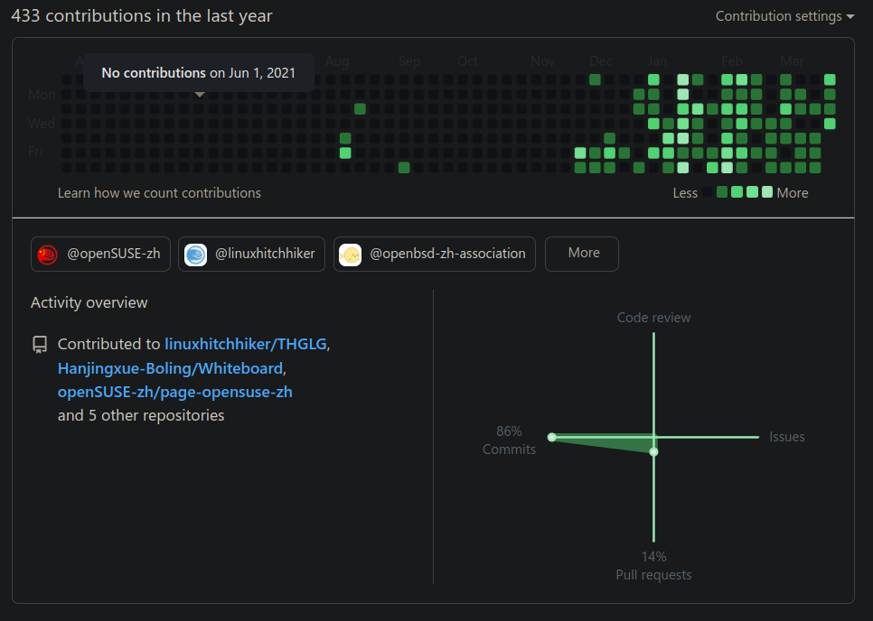

# 2022-03-30

## 摸鱼

❎ <del>为开源做贡献</del>  
✅ 公然在线摸鱼

自从学会了如何使用 GitHub 和 `git` 以后，就整日在 GitHub 上摸鱼。

摸鱼摸到人摸没了，直接大学延迟毕业。然后开启了第五年大学生活，于是乎就打算去考个本校的研究生，混个好一点的文凭……

<del>不愧是我，能拖就拖。尽整些极限操作。</del>

## WPS Office

这东西值得夸赞，是为数不多，好用，干净的国产 Linux 软件。并且对于巨硬家的文档格式有着最好的兼容性（以前使用 libreoffice 的时候，单纯打开后的视觉效果都变样了）。它的 PDF 阅读器简洁明了。并且最棒的是直接打开多个文档标签页，切换起来也十分方便。

唯一的缺点是不兼容深色模式，整个 UI 界面默认白色，我自己看久了感觉很刺眼……🤣

使用 OBS 打包的 wps-office 会缺少一些字体文件，需要手动安装字体。看样子应该是许可证的问题。

## 音乐标签

有一说一，kid3 不如 [MusicTag](https://www.cnblogs.com/vinlxc/p/11347744.html) 好用，虽然说又不是不能用，但实在是不想用。

那么多的歌曲文件需要修缮音乐标签，只能等待什么时候有空了，启动 Windows 系统再修🤣

## chrome

原来只要将 `~/.config/chrome` 文件夹备份一下就能实现本地备份 chrome 了。真希望在 Windows 下也能如此方便。

## 自定义主题与 KDE

这是一个鱼和熊掌的问题：

- 不加主题，KDE 快得飞起，并且很很稳。
- 加主题会拖慢 KDE 的反应速度，如果处理不当，可能会导致桌面环境的用户配置文件损坏。
- 但默认主题没有自定义主题来的漂亮。

<del>所以我就选了[自定义主题](../../blog/eyecandy-kde.md)。</del>🤣🤣🤣