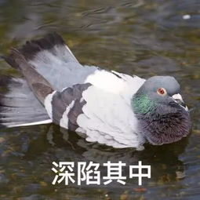

# 2022-06-01

## RSS

最近，竹林里有冰为我的小站增加了 RSS 订阅功能，但实际上的 RSS 订阅效果并不太好。所以就索性删除了。

## 时间

时间流逝得很慢的同时，也会因为人的记忆磨损流逝得飞快。

## Leap 15.4

这东西很快就要发布了，好像是在 6 月 8 日。届时中文社区应该有个线上派对。

## 论坛

现在的 Linux 中文论坛好像都熄火了（除了 openSUSE 中文论坛还有一定的热度以外），看样子更多人是聚集到即时聊天群组/频道里面进行交流。比较传统的论坛、邮件列表和 IRC 反倒而在中文社区内没啥人用了。

## 鸽子

今日又鸽了不少的事情……

