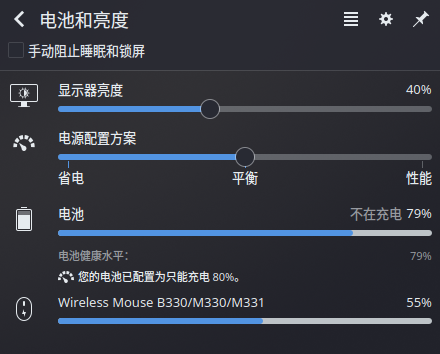

# 2022-06-05

## 电源管理

突然发现其实 KDE 自带的那个电源管理还不错：

可以手动调节性能（虽然 TLP 也可以，但是需要使用 CLI 就显得有点麻烦）。

## 重装系统

最近又把系统重装了一下，发现磁盘空间已经快用完了（剩余 19.2%，308.4GB）。

## 窗口抖动

KDE 开发者又把一个桌面特效（窗口惯性抖动）给加回来了，可喜可贺。🤣👏

## Windows 10

有一说一，WIN10 虚拟机特别占地方（60GB+），不过确实好用就是了，可以用点国产软件，然后再玩玩 galgame。

## Adobe Acrobat DC 2021

adobe 的 PDF 工具还不错，在找了一圈 PDF 转 Word 工具后，还是这个好用。