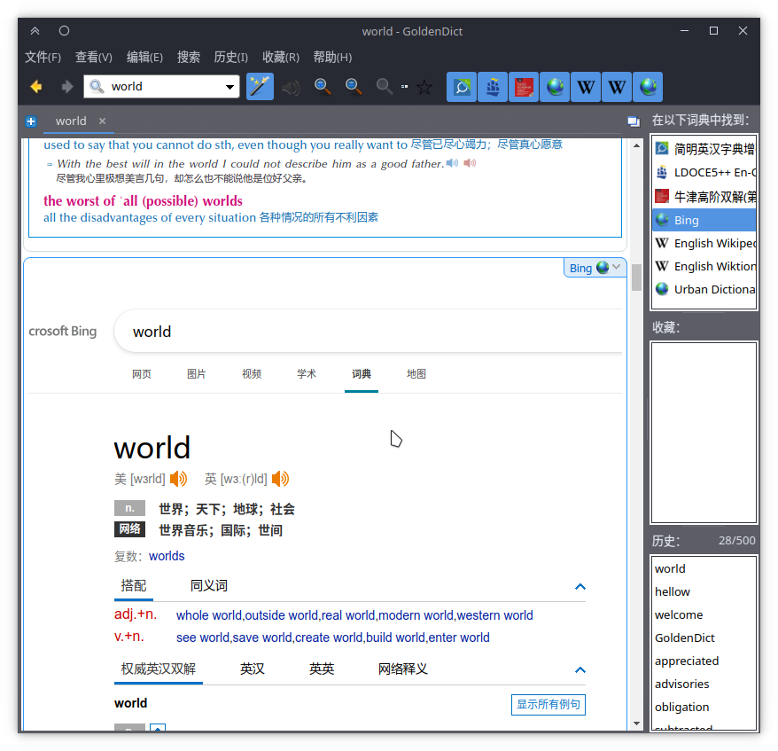
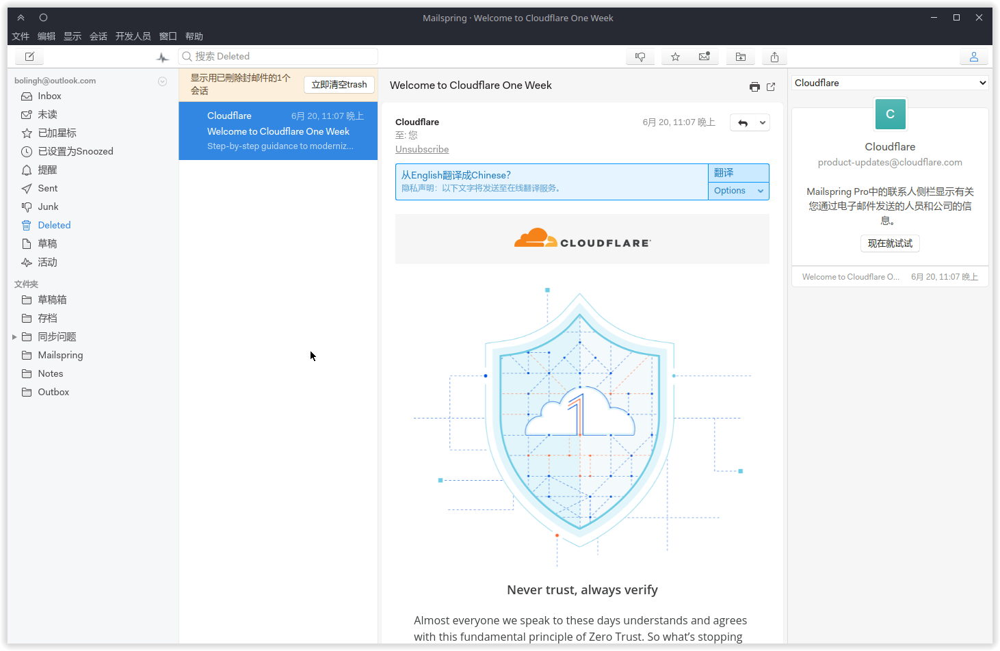

# 2022-06-21

## 必应词典

将 `https://www4.bing.com/dict/search?q=%GDWORD%&FORM=BDVSP6&cc=cn` 作为词典的在线链接即可将必应词典添加到 Goldendict 之中：

*诀窍就是将网站的地址中查询的关键字替换为 `%GDWORD%`*

## Mailspring

最近群友们推荐了一个新的邮件客户端，可以驻留后台接收通知：

整体的 UI 也比雷鸟美观多了（不过看样子是个 GTK 原生应用，和 Qt 的样式略有出入）。

## OBS Studio

它的 Flatpak 版本不管怎么调节，录制出来的视频都很卡……就……

然后突然想起了自己之前已经安装过 OBS 了。🤣🤣🤣

## 鸽子

现在唯一不鸽的事情大概是维护 openSUSE 新闻网站了……

## 键盘

啊，那种键程很长的键盘真心用不来……不如笔记本的薄膜手感好一些。

## Calibre

正在考虑要不要把 flatpak 版替换为官方仓库的 rpm 版。如果要替换的话，又要安装一串的 python310 软件包……

## 近期计划

近期打算整个蓝牙耳机或者给电脑换一块 100% sRGB 的显示屏。