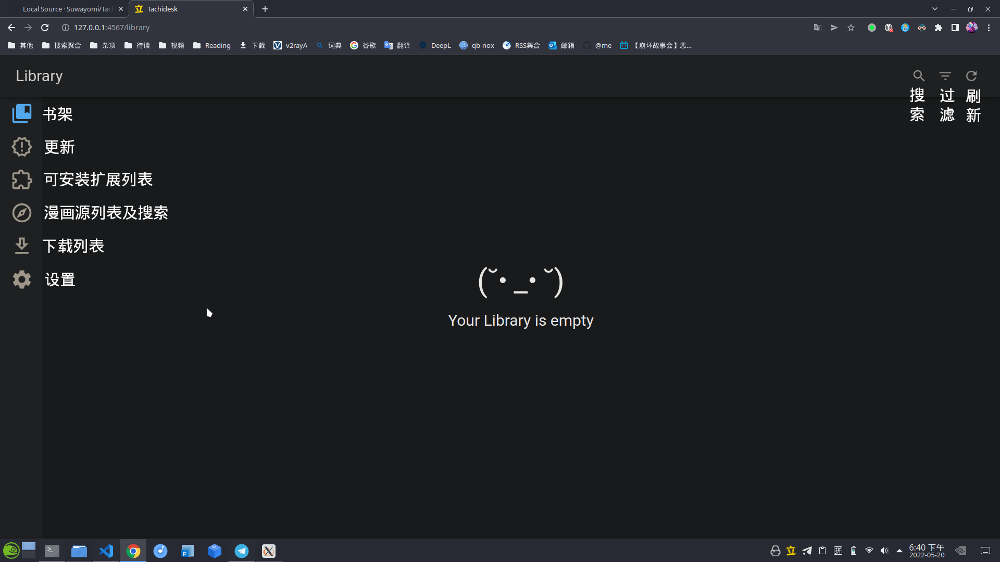

# 在 Linux 上使用 Tachidesk | 快速配置指南

!!! warning
    本文不是详尽的使用指南，默认读者曾经使用过 [Tachiyomi](https://tachiyomi.org/)。  
    Tachidesk 有许多种部署方式，本文只描述直接使用预编译的二进制文件包的办法。

## 简介

Tachidesk 是一个免费的开源漫画阅读器，可运行为 Tachiyomi 构建的扩展。Tachidesk 是独立的，但与 Tachiyomi 兼容的开源软件，它不是 Tachiyomi 的下游分支。你可以在任何支持 Java 的设备上运行这个软件。

如果你熟悉 [Tachiyomi](https://tachiyomi.org/help/guides/getting-started/)，那你也会对 Tachidesk 的用户界面倍感熟悉。

Tachidesk 主要分为两部分：Tachidesk-server （后端）和 Tachidesk 图形化前端。Tachidesk 有多个[图形化前端](https://github.com/Suwayomi/Tachidesk-Server#tachidesk-client-projects)。直接从下文的 GitHub 链接下载的文件会自动集成一个 [Tachidesk-WebUI](https://github.com/Suwayomi/Tachidesk-WebUI)。

## 准备

!!! note
    下文的链接包含的，可下载且适用于 Linux 的文件有两个，一个是类似 `Tachidesk-Server-v0.6.3-r1100.jar` 的文件，它不包含运行环境，另一个是类似 `Tachidesk-Server-v0.6.3-r1100-linux-x64.tar.gz` 的文件，它包含了一个 JRE 和 electron，你可以选择不安装 tachidesk 所需的依赖，而是直接通过配置文件直接指定依赖的可执行路径。

通过 GitHub 下载：[Tachidesk-Server - releases](https://github.com/Suwayomi/Tachidesk-Server/releases)

请将下载获得的文件解压缩或放置到某个文件夹中（比如：`~/Applications/Tachidesk`）

要使 Tachidesk 正常运行，你需要 Java8 或更新版本的 JRE，一个现代化的浏览器（chrome 或 firefox 等）以及 [ElectronJS](https://www.electronjs.org/)（可选）。

在 openSUSE 上安装 openJDK 11：

```
sudo zypper in java-11-openjdk -y
```

Tachidesk 不需要额外的配置就能直接启动，你需要在 Tachidesk 的文件夹中，打开终端，使用下列命令运行 Tachidesk：

```
$ java -jar Tachidesk-*.jar
```

命令成功运行后，会自动打开浏览器，默认的地址是 `http://127.0.0.1:4567`

### 启动后的初次配置

Tachidesk 的界面如下：



在启动前，如果你需要使用在线源，请先参考下文编辑 `server.conf` 文件，为 Tachidesk 配置好代理。

Tachidesk 默认只显示英文漫画源，你需要在扩展页面，点击右上方的筛选按钮，找到并启用 `中文` 和 `中文（HANS）` 选项。

## 配置

Tachidesk 的数据文件都位于 `~/.local/share/Tachidesk`。控制 Tachidesk 设置的配置文件是此目录中名为 `server.conf` 的纯文本文件。

需要注意的是，`server.conf` 不会因为 Tachidesk 的更新而被覆盖。配置文件使用 HOCON 编写而成，更多信息请自行谷歌。如果你错误地编辑了配置文件，你只需要删除 `server.conf`，下一次启动 Tachidesk 的时候，就会自动创建一个新的 `server.conf`。你也可以在[此处](https://github.com/Suwayomi/Tachidesk-Server/blob/master/server/src/main/resources/server-reference.conf)找到最新版本的配置文件模板。

### 可配置选项

#### 服务器地址和端口

```
server.ip = "0.0.0.0"
server.port = 4567
```

- `server.ip` 可以是 IP 地址或者域名。

#### socks 代理地址

```
server.socksProxyEnabled = false
server.socksProxyHost = ""
server.socksProxyPort = ""
```

你需要填入代理地址和代理端口，这个选项默认是禁用的。例如：

```
server.socksProxyEnabled = true
server.socksProxyHost = "127.0.0.1"
server.socksProxyPort = "20170"
```

#### webUI

```
server.webUIEnabled = true
server.initialOpenInBrowserEnabled = true
server.webUIInterface = "browser" # "browser" or "electron"
server.electronPath = ""
```

- `server.webUIEnabled` 用于控制是否启用 webui。 
- `server.initialOpenInBrowserEnabled` 用于控制 Tachidesk 是否在启动时自动打开浏览器。
- `server.webUIInterface` 决定了 Tachidesk 启动时将使用 webui 还是 electron。如果你需要使用 electron 作为 Tachidesk 的前端，你需要再安装 electron 或者手动指定 electron 的路径。
- `server.electronPath` 的值是 electron 路径。

#### 用户认证

```
server.basicAuthEnabled = false
server.basicAuthUsername = ""
server.basicAuthPassword = "" 
```

- `server.basicAuthEnabled` 是默认禁用的选项，它决定了是否使用 [HTTP 基本认证](https://en.wikipedia.org/wiki/Basic_access_authentication)来保护 Tachidesk 不受恶意侵入。这个选项建议在电脑连接至公共网络的时候启用。
- `server.basicAuthUsername` 是验证时使用的用户名。
- `server.basicAuthPassword` 是验证时使用的密码。

!!! warning
    HTTP 基本认证以明文形式发送用户名和密码，通过 HTTP 并不完全安全，建议将此功能与 nginx 等反向代理服务器配对，并通过 HTTPS 公开服务器。你的浏览器还会缓存凭据，因此在从非私人设备访问服务器时，应使用隐身模式并保持小心。

#### 杂项

```
server.debugLogsEnabled = false
server.systemTrayEnabled = true
```

- `server.debugLogsEnabled` 用于控制通过终端运行 Tachidesk 时输出的内容，启用后，终端会输出更多的调试信息。
- `server.systemTrayEnabled = true` 用于控制 Tachidesk 启动后，是否应该在任务栏显示托盘图标。

## 其他

### 本地漫画源

Tachidesk 支持用户使用本地的漫画源，其文件夹的默认位置是 `~/.local/share/Tachidesk/local`

Tachidesk 本地漫画源的编排方式基本与 Tachiyomi 相同。你可以阅读 Tachiyomi 的[官方文档](https://tachiyomi.org/help/guides/local-manga/#folder-structure)获得更多的帮助信息。

### 覆写配置

你可以使用上述的选项作为命令行的参数覆盖原有的配置。主要格式如下：

```
java -Dsuwayomi.tachidesk.config.<configuration option 1>=<configuration value 1> -Dsuwayomi.tachidesk.config.<configuration option 2>=<configuration value 2> ... -Dsuwayomi.tachidesk.config.<configuration option N>=<configuration value N> -jar <path to server jar>
```

即 `-Dsuwayomi.tachidesk.<配置选项>=<配置值>`，同时还可以并列多个选项。例如：

```
$ java -Dsuwayomi.tachidesk.server.socksProxyEnabled=false -Dsuwayomi.tachidesk.server.basicAuthEnabled=true -jar Tachidesk-*.jar
```

注意：你可以将上面的命令放在自定义启动器脚本中，就像在[此处](https://github.com/Suwayomi/Tachidesk-Server/tree/master/scripts/resources)找到的那样。

### 重定向数据文件夹

你可以使用 `server.rootDir="<目录路径>"` 重新指定 Tachidesk 的数据文件夹。

## 额外的配置

### 设置网络代理切换脚本

Tachidesk 使用代理服务器访问国内漫画源的时候，可能会出现无法加载的情况（某些漫画源会屏蔽来自特定 IP 段的访问）。这个问题可以通过使用额外的命令参数解决。

```
$ java -Dsuwayomi.tachidesk.server.socksProxyEnabled=false -jar Tachidesk-*.jar
```

### 创建 XDG 桌面条目

详细信息可阅读 [Desktop entries - ArchLinux Wiki](https://wiki.archlinux.org/title/desktop_entries)。

你可以在[此处](https://github.com/Suwayomi/Tachidesk-Server/tree/master/scripts/resources)找到开发者准备好的启动器脚本。然后将 `*.desktop` 文件放置到 `~/.local/share/applications` 中，如果需要所有用户都能访问，请把文件放置到 `/usr/share/applications`

### 示例配置文件

!!! note
    创建完成后，记得使用 `chmod` 为这些文件添加可执行权限。

```shell
bh@c004-h0:~/.local/share/applications> cat tachidesk.desktop
[Desktop Entry]
Type=Application
Name=Tachidesk
Comment=漫画阅读器
Exec=/home/bh/Applications/Tachidesk/01-start.sh
Icon=/home/bh/.local/share/Tachidesk/webUI/favicon.ico
Terminal=false
Categories=Network;
bh@c004-h0:~/.local/share/applications> cat tachidesk-china.desktop
[Desktop Entry]
Type=Application
Name=Tachidesk 中文
Comment=漫画阅读器
Exec=/home/bh/Applications/Tachidesk/02-start.sh
Icon=/home/bh/.local/share/Tachidesk/webUI/favicon.ico
Terminal=false
Categories=Network;
```

```shell
bh@c004-h0:~/Applications/Tachidesk> cat 01-start.sh
#!/bin/bash
cd /home/bh/Applications/Tachidesk/ && java -jar Tachidesk-Server.jar
bh@c004-h0:~/Applications/Tachidesk> cat 02-start.sh
#!/bin/bash
cd /home/bh/Applications/Tachidesk/
java -Dsuwayomi.tachidesk.config.server.socksProxyEnabled=false -jar Tachidesk-Server.jar
```