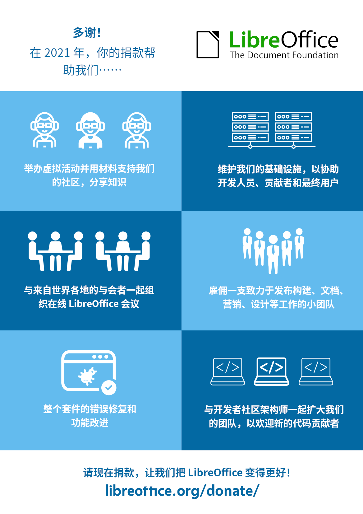

# 捐款如何在 2021 年帮助我们

## 作品信息

- [How donations helped us in 2021](https://blog.documentfoundation.org/blog/2022/02/16/how-donations-helped-us-in-2021/) 一文由 [Mike Saunders](https://blog.documentfoundation.org/blog/author/mikesaunders/) 于 2022 年 2 月 16 日发布于 [Document Foundation Blog](https://blog.documentfoundation.org/)，以 [CC-BY-SA 3.0](https://creativecommons.org/licenses/by-sa/3.0/) 进行授权。
- 翻译者：Hanjingxue Boling，以 CC-BY-SA 3.0 进行发布。

----

## 正文

[向文档基金会捐款](https://www.libreoffice.org/donate/)有助于我们发展社区、运行基础设施、组织活动和分享知识。 因此，LibreOffice 不断为所有用户改进！ 非常感谢我们所有的支持者。 这是一张快速信息图，显示了我们在 2021 年如何使用你的[捐款](https://www.libreoffice.org/donate/)：

